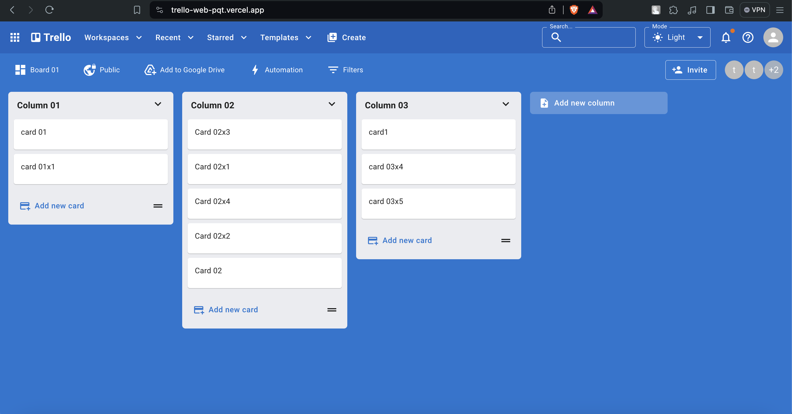

### Trello Web (MERN Stack)
Developed a Trello-like web app with advanced drag-and-drop features. Implemented both front-end and back-end functionalities using ReactJS, ExpressJS, NodeJS and MongoDB. Deployed Front-end on Vercel and Back-end on Render.

## Features
Employed various front-end and back-end technologies and programming
techniques, including JavaScript, ReactJS with Hooks, Material UI, Dnd-kit, ExpressJS, Middleware, Babel, CORS, Joi, MongoDB, etc.
Deployed the web application to Vercel and Render for live access and testing.

## Requirements

-  "react": "^18.2.0",
-  "@dnd-kit/core": "^6.0.8",
-   @dnd-kit/sortable": "^7.0.2",
-   @dnd-kit/utilities": "^3.2.1", ...
-   node v18.16.0

# Deploy link:
https://trello-web-pqt.vercel.app/

  
## Screenshots

